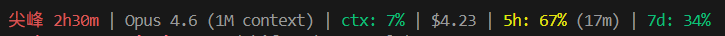

# claude-code-statusline

[English](#english) | [繁體中文](#繁體中文)

---

<a id="english"></a>

A cross-platform statusline for [Claude Code](https://docs.anthropic.com/en/docs/claude-code) that shows **peak/off-peak hour awareness**, context usage, session cost, and rate limits — all in one glance.




## Background

In March 2026, Anthropic [announced](https://x.com/trq212/status/2037254607001559305) adjustments to Claude's 5-hour session limits during peak hours:

> "During weekdays between 5am–11am PT / 1pm–7pm GMT, you'll move through your 5-hour session limits faster than before."
> — Thariq Shihipar, Anthropic

About 7% of users are affected. Weekly limits remain unchanged. Weekends are entirely off-peak.

See also: [Claude March 2026 Usage Promotion](https://support.claude.com/en/articles/14063676-claude-march-2026-usage-promotion) (expired)

### Peak hours by timezone

| Timezone | Peak hours (weekdays only) |
|----------|---------------------------|
| PT (UTC-7) | 05:00 – 11:00 |
| ET (UTC-4) | 08:00 – 14:00 |
| GMT (UTC+0) | 13:00 – 19:00 |
| CET (UTC+1) | 14:00 – 20:00 |
| IST (UTC+5:30) | 18:30 – 00:30 |
| CST (UTC+8) | 20:00 – 02:00+1 |
| JST/KST (UTC+9) | 21:00 – 03:00+1 |

Weekends are **all-day off-peak** regardless of timezone.

> For users in Asia (UTC+8/+9), normal working hours (9am–6pm) are entirely off-peak. Peak hours fall late at night when most people are asleep.

## Features

- **Peak/off-peak indicator** with countdown timer during peak hours
- **Context window** usage percentage (color-coded: green → yellow → red)
- **Session cost** in USD
- **5-hour rate limit** usage with reset countdown
- **7-day rate limit** usage
- **Configurable timezone** — one number to change
- **Cross-platform** — works on Windows, macOS, and Linux

## Prerequisites

- [Claude Code](https://docs.anthropic.com/en/docs/claude-code) CLI
- [Node.js](https://nodejs.org/) (any recent version)

Node.js was chosen over bash specifically for cross-platform compatibility — the same script runs identically on Windows, macOS, and Linux without modification.

## Quick Start

### Option 1: Installer

**macOS / Linux:**

```bash
git clone https://github.com/haunchen/claude-code-statusline.git
cd claude-code-statusline
bash install.sh
```

**Windows (PowerShell):**

```powershell
git clone https://github.com/haunchen/claude-code-statusline.git
cd claude-code-statusline
powershell -ExecutionPolicy Bypass -File install.ps1
```

The installer will:
1. Check that Node.js is installed
2. Back up your existing `~/.claude/settings.json`
3. Add the statusLine configuration

### Option 2: Manual setup

1. Clone this repo anywhere on your machine
2. Edit `statusline.js` — set `UTC_OFFSET` to your timezone (default: `8` for UTC+8)
3. Add to `~/.claude/settings.json`:

```json
{
  "statusLine": {
    "type": "command",
    "command": "node /path/to/claude-code-statusline/statusline.js",
    "padding": 0
  }
}
```

4. Restart Claude Code

### Option 3: Let Claude Code do it

Run `/statusline` inside Claude Code and paste this prompt:

> Show peak/off-peak hours for Claude Code based on my timezone. During peak hours (weekdays 5am-11am PT), show "PEAK" in red with a countdown. During off-peak, show "OFF-PEAK" in green. Weekends are always off-peak. Also show: model name, context usage %, session cost, 5-hour rate limit % with reset countdown, and 7-day rate limit %. Color-code percentages green/yellow/red at 60%/80% thresholds.

## Customization

### Change timezone

Edit the `UTC_OFFSET` constant at the top of `statusline.js`:

```javascript
const UTC_OFFSET = 8;  // Taiwan, Singapore, Hong Kong, Perth
const UTC_OFFSET = 9;  // Japan, Korea
const UTC_OFFSET = 0;  // UK (GMT)
const UTC_OFFSET = -5; // US Eastern
```

### Use a simpler version

Check the `examples/` folder:

| File | What it shows |
|------|---------------|
| `examples/minimal.js` | Peak/off-peak + model name only |
| `examples/with-rate-limits.js` | Peak/off-peak + model + rate limits |
| `statusline.js` | Everything (peak, context, cost, rate limits) |

## How it works

Claude Code runs the statusline script after each assistant message. It pipes a JSON object to stdin containing session data:

```json
{
  "model": { "display_name": "Opus" },
  "context_window": {
    "context_window_size": 200000,
    "used_percentage": 8,
    "current_usage": { "input_tokens": 15000, "cache_read_input_tokens": 2000, "..." : "..." }
  },
  "cost": { "total_cost_usd": 0.0123 },
  "rate_limits": {
    "five_hour": { "used_percentage": 23.5, "resets_at": 1738425600 },
    "seven_day": { "used_percentage": 41.2, "resets_at": 1738857600 }
  }
}
```

The script reads this JSON, determines peak/off-peak status based on your timezone, and prints the formatted statusline to stdout.

### Peak detection logic

Instead of relying on the system timezone (which may differ across machines), the script converts UTC to your local time explicitly:

```javascript
const now = new Date(Date.now() + UTC_OFFSET * 3600_000);
const hour = now.getUTCHours();
```

This approach is timezone-agnostic — the same script produces correct results on any OS regardless of the system's timezone setting.

## License

MIT

---

<a id="繁體中文"></a>

# claude-code-statusline

[English](#english) | [繁體中文](#繁體中文)

跨平台的 [Claude Code](https://docs.anthropic.com/en/docs/claude-code) 狀態列，一眼掌握尖峰/離峰時段、context 用量、費用與速率限制。


## 背景

2026 年 3 月，Anthropic [宣布](https://x.com/trq212/status/2037254607001559305)調整尖峰時段的 5 小時 session 額度：

> "During weekdays between 5am–11am PT / 1pm–7pm GMT, you'll move through your 5-hour session limits faster than before."
> — Thariq Shihipar, Anthropic

約 7% 的使用者受影響。每週總額度不變。週末全天為離峰。

另見：[Claude 2026 年 3 月用量促銷](https://support.claude.com/en/articles/14063676-claude-march-2026-usage-promotion)（已結束）

### 各時區尖峰時段對照

| 時區 | 尖峰時段（僅平日） |
|------|-------------------|
| PT (UTC-7) | 05:00 – 11:00 |
| ET (UTC-4) | 08:00 – 14:00 |
| GMT (UTC+0) | 13:00 – 19:00 |
| CET (UTC+1) | 14:00 – 20:00 |
| IST (UTC+5:30) | 18:30 – 00:30 |
| CST (UTC+8) | 20:00 – 02:00+1 |
| JST/KST (UTC+9) | 21:00 – 03:00+1 |

週末不分時區，全天離峰。

> 亞洲使用者（UTC+8/+9）的正常上班時間（9am–6pm）完全落在離峰時段。尖峰時段在深夜，大多數人已經在睡覺了。

## 功能

- 尖峰/離峰即時顯示，尖峰時附倒數計時
- Context window 用量百分比（綠 → 黃 → 紅）
- 本次 session 費用（USD）
- 5 小時速率限制用量 + 重置倒數
- 7 天速率限制用量
- 可設定時區 — 只需改一個數字
- 跨平台 — Windows、macOS、Linux 通用

## 系統需求

- [Claude Code](https://docs.anthropic.com/en/docs/claude-code) CLI
- [Node.js](https://nodejs.org/)（任何近期版本）

選用 Node.js 而非 bash，是為了跨平台相容性 — 同一份腳本在 Windows、macOS、Linux 上無需修改即可執行。

## 快速開始

### 方法一：安裝腳本

**macOS / Linux：**

```bash
git clone https://github.com/haunchen/claude-code-statusline.git
cd claude-code-statusline
bash install.sh
```

**Windows (PowerShell)：**

```powershell
git clone https://github.com/haunchen/claude-code-statusline.git
cd claude-code-statusline
powershell -ExecutionPolicy Bypass -File install.ps1
```

安裝腳本會：
1. 檢查 Node.js 是否已安裝
2. 詢問腳本安裝位置（預設 `~/.claude/`）
3. 備份現有的 `~/.claude/settings.json`
4. 寫入 statusLine 設定

### 方法二：手動設定

1. Clone 此 repo 到任意位置
2. 編輯 `statusline.js` — 將 `UTC_OFFSET` 設為你的時區（預設 `8` 為 UTC+8）
3. 在 `~/.claude/settings.json` 加入：

```json
{
  "statusLine": {
    "type": "command",
    "command": "node /path/to/claude-code-statusline/statusline.js",
    "padding": 0
  }
}
```

4. 重啟 Claude Code

### 方法三：讓 Claude Code 幫你設定

在 Claude Code 中執行 `/statusline`，貼上以下 prompt：

> Show peak/off-peak hours for Claude Code based on my timezone. During peak hours (weekdays 5am-11am PT), show "PEAK" in red with a countdown. During off-peak, show "OFF-PEAK" in green. Weekends are always off-peak. Also show: model name, context usage %, session cost, 5-hour rate limit % with reset countdown, and 7-day rate limit %. Color-code percentages green/yellow/red at 60%/80% thresholds.

## 自訂設定

### 更改時區

編輯 `statusline.js` 頂部的 `UTC_OFFSET` 常數：

```javascript
const UTC_OFFSET = 8;  // 台灣、新加坡、香港、伯斯
const UTC_OFFSET = 9;  // 日本、韓國
const UTC_OFFSET = 0;  // 英國 (GMT)
const UTC_OFFSET = -5; // 美東
```

### 使用精簡版本

查看 `examples/` 資料夾：

| 檔案 | 顯示內容 |
|------|---------|
| `examples/minimal.js` | 僅尖峰/離峰 + 模型名稱 |
| `examples/with-rate-limits.js` | 尖峰/離峰 + 模型 + 速率限制 |
| `statusline.js` | 完整版（尖峰、context、費用、速率限制） |

## 運作原理

Claude Code 在每次 assistant 回應後執行 statusline 腳本，透過 stdin 傳入包含 session 資料的 JSON：

```json
{
  "model": { "display_name": "Opus" },
  "context_window": {
    "context_window_size": 200000,
    "used_percentage": 8,
    "current_usage": { "input_tokens": 15000, "cache_read_input_tokens": 2000, "..." : "..." }
  },
  "cost": { "total_cost_usd": 0.0123 },
  "rate_limits": {
    "five_hour": { "used_percentage": 23.5, "resets_at": 1738425600 },
    "seven_day": { "used_percentage": 41.2, "resets_at": 1738857600 }
  }
}
```

腳本讀取 JSON，根據你的時區判斷尖峰/離峰狀態，將格式化後的狀態列輸出到 stdout。

### 尖峰判斷邏輯

不依賴系統時區（不同機器可能不同），而是明確地將 UTC 轉換為本地時間：

```javascript
const now = new Date(Date.now() + UTC_OFFSET * 3600_000);
const hour = now.getUTCHours();
```

這個方法與時區無關 — 同一份腳本在任何作業系統上都能產出正確結果，不受系統時區設定影響。

## 授權

MIT
